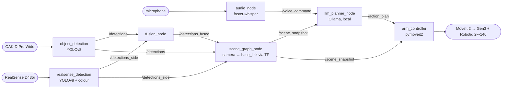

# Audio-Visual Spatial Control for a Kinova Gen3 7-DOF Manipulator

Master's thesis project, UC Riverside (advisor: Prof. Mingyu Cai).

A person speaks a command — *"pick up the cup and put it on the right side"* — and the
Kinova Gen3 carries it out. Speech is transcribed offline, a **locally-run** LLM turns it
into a plan grounded in what the cameras see, and MoveIt 2 executes it. No paid or cloud
APIs are used anywhere in the pipeline.


> **Status.** The voice → plan → motion chain runs end to end in dry run. `pick` now moves
> to the object before grasping, but has **not yet been validated on the real arm** — see
> [Known limitations](#known-limitations) and the staged test plan in [TESTING.md](TESTING.md).

---

## How it works



1. **`audio_node`** records speech (push-to-talk or voice-activity detection) and transcribes
   it with faster-whisper → `/voice_command`.
2. **`object_detection`** (OAK-D) and **`realsense_detection`** (RealSense) run YOLOv8, look up
   depth at each detection and publish a 3D point **in the camera's own frame**, tagged with
   that frame's `frame_id`. `fusion_node` optionally merges the two cameras' detections.
3. **`scene_graph_node`** is the single place where camera coordinates become robot
   coordinates: it transforms every detection to `base_link` through TF and keeps a live world
   model with `reachable`, `stale` and spatial relations (`near_`, `left_of_`, `right_of_`)
   → `/scene_snapshot`.
4. **`llm_planner_node`** sends the scene and the command to a local model via Ollama
   (default `qwen2.5:7b`), gets back a JSON plan, and runs a safety validator (workspace
   bounds, height floor, object exists and has a known height) before publishing
   `/action_plan`.
5. **`arm_controller`** executes the plan with pymoveit2 and the Robotiq gripper action.
   For `pick` it looks up the object's latest position in the scene, then: open → move above
   → straight-line descend → close → lift. It starts in **dry run** by default.

### Coordinate-frame rule

Every x/y/z in `/scene_snapshot` and `/action_plan` is in **`base_link`**. Detections reach
`scene_graph_node` either with robot-frame coordinates or with camera coordinates plus a
`frame_id`; anything else is dropped rather than guessed. An unknown height is published as
`null` and such objects are reported as not reachable.

### Plan actions

| Action | Fields | Implemented |
|---|---|---|
| `move_to` | `x, y, z` | yes |
| `pick` | `object_id, approach_z` | yes — moves to the object (not yet validated on hardware) |
| `place` | `x, y, z` | yes — moves there and opens (no approach from above yet) |
| `open_gripper` / `close_gripper` | — | yes |
| `go_home` | — | yes |
| `null_space_adjust` | `objective` | **stub** — logs and returns success |

---

## Hardware

| Component | Role | Driver / topics |
|---|---|---|
| Kinova Gen3 7-DOF + Robotiq 2F-140 | manipulator | `ros2_kortex` + MoveIt 2, group `manipulator`, gripper action `/robotiq_gripper_controller/gripper_cmd` |
| OAK-D Pro Wide | fixed global camera (eye-to-base) | `oak_camera_node.py` (depthai **v2**), `/global_camera/color\|depth/...`, 416×256, frame `global_camera_link` |
| Intel RealSense D435i | fixed global camera (eye-to-base) | `realsense2_camera`, `/global_camera/global_camera/...`, frame `global_camera_color_optical_frame` |
| Kinova built-in wrist camera | eye-in-hand | `kinova_vision`, `/camera/...`; extrinsic comes from the Kinova URDF. Used for point clouds, not yet for detection |

### Camera calibration (TF)

| Transform | Published by | Source of values |
|---|---|---|
| `base_link → global_camera_link` (OAK-D) | `thesis_robot camera_tf_broadcaster` — the only publisher | `~/.ros/handeye_calibration_corrected.yaml` (`translation` + `rotation_quat`, as written by `handeye_calibration.py`). If the file is missing, the last known OAK-D calibration is used. |
| `base_link → global_camera_color_optical_frame` (RealSense) | `static_transform_publisher` in the lab's `cameras.launch.py` | easy_handeye2 result |
| `end_effector_link → camera_link` (wrist) | Kinova URDF / `kinova_vision` | factory |

To recalibrate the OAK-D, write the new result to the YAML file and restart
`camera_tf_broadcaster` — no code changes.

---

## Running

Requires ROS 2 (developed and tested on **Jazzy**), MoveIt 2, `ros2_kortex`,
`realsense2_camera`, `kinova_vision`, `pymoveit2`, `ultralytics`, `depthai==2.x`,
[Ollama](https://ollama.com) with the model pulled, and the Python packages in
[`src/thesis_robot/requirements.txt`](src/thesis_robot/requirements.txt).
The vendor packages are **not** in this repo (see `.gitignore`); they live in the lab
workspace `~/workspace/ros2_kortex_ws`.

```bash
cd ~/workspace/ros2_kortex_ws && colcon build --packages-select thesis_robot
source install/setup.bash
```

One terminal each:

```bash
# 1. robot + MoveIt (lab workspace launch file)
ros2 launch kinova_gen3_7dof_robotiq_2f_140_moveit_config robot.launch.py robot_ip:=192.168.1.10

# 2. cameras (lab launch file): RealSense + its calibration TF, wrist camera,
#    and — by default (launch_oak_camera:=true) — oak_camera_node.py
ros2 launch kinova_gen3_7dof_robotiq_2f_140_moveit_config cameras.launch.py robot_ip:=192.168.1.10
#    OAK-D calibration TF (oak_camera_node.py no longer publishes it)
ros2 run thesis_robot camera_tf_broadcaster
#    Alternative: cameras.launch.py launch_oak_camera:=false, then
#    ros2 launch ~/workspace/ros2_kortex_ws/oak_launch.py   (camera + TF together)
#    Never start the OAK-D twice — the second driver fails with "OAK-D busy".

# 3. perception
ros2 run thesis_robot object_detection
ros2 run thesis_robot realsense_detection
ros2 run thesis_robot fusion_node          # optional
ros2 run thesis_robot scene_graph_node

# 4. planning (Ollama must be running: `ollama serve`, `ollama pull qwen2.5:7b`)
ros2 run thesis_robot llm_planner_node

# 5. execution — dry run by default; add -p dry_run:=false to move the arm
ros2 run thesis_robot arm_controller

# 6. voice (needs its own terminal: push-to-talk reads Enter)
ros2 run thesis_robot audio_node
```

Do **not** run `yolo_detector` together with the pipeline: it also publishes `/detections`,
in a format without 3D coordinates.

### Useful parameters

| Node | Parameter | Default |
|---|---|---|
| `audio_node` | `mode` (`push_to_talk` / `vad`), `model_size`, `device` | `push_to_talk`, `large-v3`, `cuda` |
| `llm_planner_node` | `model` | `qwen2.5:7b` |
| `object_detection` | `desired_object` | `bottle` |
| `arm_controller` | `dry_run`, `speed`, `grasp_z_offset`, `pregrasp_clearance` | `true`, `0.20`, `0.0`, `0.10` |
| `camera_tf_broadcaster` | `calibration_file`, `parent_frame`, `child_frame` | see above |

### Topics for monitoring

`/audio_status`, `/planner_status`, `/arm_status`, `/pick_place_status`, `/scene_snapshot`,
`/object_detection/debug_image`.

---

## Repository layout

| Path | What it is |
|---|---|
| `src/thesis_robot/` | **The thesis pipeline** (ROS 2 package): the nodes above, plus the older bottle-grasp chain (`bottle_filter` → `bottle_segmentation` → `grasp_detector` → `pick_and_place`, built on `yolo_ros`) |
| `oak_camera_node.py`, `oak_launch.py` | OAK-D driver and launch file |
| `sensor_fusion_node.py`, `pointcloud_fusion.py`, `wrist_pcl_node.py` | Multi-camera point-cloud fusion for MoveIt's octomap (two alternative fusers: `/fused/points` in `base_link`, `/fused_pointcloud` in `world`) |
| `handeye_calibration.py` (OAK-D), `handeye_calibrationintel.py` (RealSense), `calibration_helper.py`, `auto_calibrate.py`, `check_alignment.py`, marker TF publishers | Hand-eye calibration tools |
| `src/calib_pkg/`, `src/matlab/`, `src/my_handeye_config/` | Earlier calibration pipelines (checkerboard data collection, MATLAB hand-eye, easy_handeye2 config) |
| `src/glass_pick_place/`, `src/glass_pick_node.py`, `src/visual_servo_node.py`, `src/demo_node.py`, `src/global_camera_perception/` (C++) | ArUco-based glass pick-and-place track |
| `src/kinova_moveit2_obb/`, `src/moveit2_obb/` | Gazebo YOLOv8-OBB pick-and-place tutorial (Kinova port and original Franka Panda) |
| `robot_keepalive.py`, `three_camera_subscriber.py` | Robot idle keepalive; camera health monitor |
| `pick_and_place.py` (root), `object_detection.py` (root — actually an older OAK driver), `glass_positions.py`, `src/pick.py` | **Legacy / standalone.** Hard-coded calibrations, bypass TF; `src/pick.py` imports modules that are not in this repo |
| `01_Setup.md`, `02_Dev_Environment.md`, `weeklyplan` | Original setup notes and 12-week plan (Kortex-API phase) |
| [`TESTING.md`](TESTING.md) | Staged test plan for the core pipeline on the real arm |

---

## Known limitations

- **Not yet validated on hardware:** the `pick` sequence, the gripper open/close values
  (`GRIPPER_OPEN = 0.14`, `GRIPPER_CLOSED = 0.02` in `arm_controller_node.py` — other scripts
  on the same gripper use the opposite convention) and the grasp orientation
  (`[0, 0.707, 0, 0.707]`). [TESTING.md](TESTING.md) checks all three.
- **Calibration offset:** object positions are off by roughly 9 cm on one axis. A closed-loop
  per-camera calibrator (marker on the end effector, rigid-transform fit) is planned.
- **`null_space_adjust` is a stub.** Occlusion-aware use of the arm's redundancy — the
  intended research contribution — is not implemented yet.
- **No re-observation:** plans run open-loop. `pick` uses the latest scene position at
  execution time, but nothing re-plans if the object moves.
- **Spatial relations are simple:** fixed thresholds (12 cm near, 8 cm left/right), "left"
  means more negative `y` in `base_link` (the robot's view, not the speaker's), and relations
  are keyed by label, so two cups are ambiguous.
- **LLM latency** is 11–52 s per plan.
- **`fusion_node`** matches detections by comparing camera coordinates from two different
  cameras, which is unreliable. `depth_3d_node` expects fields no current detector sends.
- **Point-cloud fusion:** callbacks not firing in one fusion node was still being debugged.
- **Lab-machine dependencies:** `robot.launch.py` and `cameras.launch.py` are not in this
  repo, and YOLO weights are loaded from `/home/lab/workspace/ros2_kortex_ws/yolov8m.pt`.
