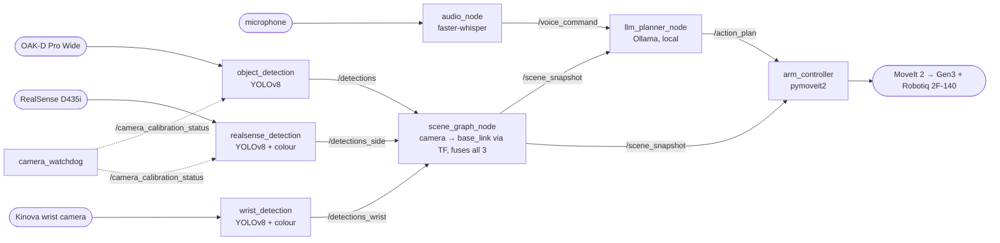

# Audio-Visual Spatial Control for a Kinova Gen3 7-DOF Manipulator

Master's thesis project, UC Riverside (advisor: Prof. Mingyu Cai).

A person speaks a command — *"pick up the cup and put it on the right side"* — and the
Kinova Gen3 carries it out. Speech is transcribed offline, a **locally-run** LLM turns it
into a plan grounded in what the cameras see, and MoveIt 2 executes it. No paid or cloud
APIs are used anywhere in the pipeline.


> **Status.** The voice → plan → motion chain runs end to end in dry run. `pick` now moves
> to the object before grasping, but has **not yet been validated on the real arm** — see
> [Known limitations](#known-limitations) and the staged test plan in [TESTING.md](TESTING.md).

---

## How it works



1. **`audio_node`** records speech (push-to-talk or voice-activity detection) and transcribes
   it with faster-whisper → `/voice_command`.
2. **`object_detection`** (OAK-D), **`realsense_detection`** (RealSense) and **`wrist_detection`**
   (Kinova wrist camera) each run YOLOv8, look up depth at each detection and publish a 3D
   point **in the camera's own frame**, tagged with that frame's `frame_id`.
3. **`scene_graph_node`** is the single place where camera coordinates become robot
   coordinates *and* where the three cameras get fused: it transforms every detection to
   `base_link` through TF, blends detections of the same object from different cameras with a
   confidence-weighted running average (rather than the latest camera simply overwriting the
   others), and keeps a live world model with `reachable`, `stale` and spatial relations
   (`near_`, `left_of_`, `right_of_`) → `/scene_snapshot`. There is no separate fusion node —
   `fusion_node.py` (which only matched two hardcoded, non-heterogeneous cameras by comparing
   raw camera-frame coordinates directly) has been retired in favor of this.
4. **`llm_planner_node`** sends the scene and the command to a local model via Ollama
   (default `qwen2.5:7b`), gets back a JSON plan, and runs a safety validator (workspace
   bounds, height floor, object exists and has a known height) before publishing
   `/action_plan`.
5. **`arm_controller`** executes the plan with pymoveit2 and the Robotiq gripper action.
   For `pick` it looks up the object's latest position in the scene, then: open → move above
   → straight-line descend → close → lift. It starts in **dry run** by default.

### Coordinate-frame rule

Every x/y/z in `/scene_snapshot` and `/action_plan` is in **`base_link`**. Detections reach
`scene_graph_node` either with robot-frame coordinates or with camera coordinates plus a
`frame_id`; anything else is dropped rather than guessed. An unknown height is published as
`null` and such objects are reported as not reachable.

### Plan actions

| Action | Fields | Implemented |
|---|---|---|
| `move_to` | `x, y, z` | yes |
| `pick` | `object_id, approach_z` | yes — moves to the object (not yet validated on hardware) |
| `place` | `x, y, z` | yes — moves there and opens (no approach from above yet) |
| `open_gripper` / `close_gripper` | — | yes |
| `go_home` | — | yes |
| `null_space_adjust` | `objective` | **stub** — logs and returns success |

---

## Hardware

| Component | Role | Driver / topics |
|---|---|---|
| Kinova Gen3 7-DOF + Robotiq 2F-140 | manipulator | `ros2_kortex` + MoveIt 2, group `manipulator`, gripper action `/robotiq_gripper_controller/gripper_cmd` |
| OAK-D Pro Wide | independently-placed camera | `oak_camera_node.py` (depthai **v2**), `/global_camera/color\|depth/...`, 416×256, frame `global_camera_link` |
| Intel RealSense D435i | independently-placed camera | `realsense2_camera`, `/global_camera/global_camera/...`, frame `global_camera_color_optical_frame` |
| Kinova built-in wrist camera | eye-in-hand, calibration anchor | `kinova_vision`, `/camera/...`; extrinsic comes from the Kinova URDF/kinematic chain (exact, no calibration needed). Feeds `wrist_detection` as a third fusion source |

OAK-D and RealSense are "independently-placed" rather than fixed-mount: they can be
repositioned, and re-calibrate from wherever they end up (see below) instead of assuming a
known mounting position.

### Camera calibration (TF)

| Transform | Published by | Source of values |
|---|---|---|
| `base_link → global_camera_link` (OAK-D) | `thesis_robot camera_tf_broadcaster`, one instance per camera (remap `__node`) | `~/.ros/oakd_calibration.yaml`, written by `calibration/multi_camera_calibrate.py` |
| `base_link → global_camera_color_optical_frame` (RealSense) | `thesis_robot camera_tf_broadcaster`, second instance | `~/.ros/realsense_calibration.yaml`, written by `calibration/multi_camera_calibrate.py` |
| `base_link → <wrist frame>` | Kinova URDF / `kinova_vision` / `kortex_bringup` | factory kinematic chain — never (re)calibrated |

**How OAK-D and RealSense get calibrated:** place a ChArUco board (same spec as
`handeye_calibration.py`'s: 5×7 squares, 40mm/20mm, `DICT_6X6_250`) somewhere near the robot
base where the wrist camera and the camera(s) being calibrated can all see it, then run:

```bash
python3 calibration/multi_camera_calibrate.py
```

This uses the **wrist camera as the calibration anchor** — its `base_link → wrist` transform
is already exact from the robot's own kinematics, so seeing the board from the wrist camera
gives `base_link → board` for free, with no offline hand-eye session. OAK-D and RealSense each
solve their own `camera → board` from a single frame, and the script composes the two to get
`base_link → camera` for each, writing it to that camera's YAML. **Restart that camera's
`camera_tf_broadcaster` instance** to pick up the new file (it only reads it at startup):

```bash
ros2 run thesis_robot camera_tf_broadcaster --ros-args -r __node:=oakd_tf_broadcaster \
  -p calibration_file:=~/.ros/oakd_calibration.yaml -p parent_frame:=base_link -p child_frame:=global_camera_link
ros2 run thesis_robot camera_tf_broadcaster --ros-args -r __node:=realsense_tf_broadcaster \
  -p calibration_file:=~/.ros/realsense_calibration.yaml -p parent_frame:=base_link -p child_frame:=global_camera_color_optical_frame
```

The board can then be removed — nothing at runtime keeps looking for it.

**If a camera drops and reconnects** (unplugged, bumped, USB dropout), `camera_watchdog`
notices and flags it — it does **not** silently keep using its old calibration, since the
camera may have moved. `object_detection`/`realsense_detection` stop publishing for that
camera (logged, and the debug image says `BLOCKED`) until `multi_camera_calibrate.py` is rerun
with the board back in view, which clears the flag.

`handeye_calibration.py`/`handeye_calibrationintel.py` (the older moving-EE-marker, 15+-pose,
`cv2.calibrateHandEye` method) are superseded by the above for normal use, but are left in the
repo — they're a more accurate but manual/offline alternative if extreme precision is ever
needed. Note: they currently fail on this machine's OpenCV (4.13) — `CharucoBoard_create`/
`DetectorParameters_create` were removed upstream; `multi_camera_calibrate.py` and
`calibration/markers/charuco_detector.py` were written against the current
`cv2.aruco.CharucoDetector` API instead.

---

## Running

Requires ROS 2 (developed and tested on **Jazzy**), MoveIt 2, `ros2_kortex`,
`realsense2_camera`, `kinova_vision`, `pymoveit2`, `ultralytics`, `depthai==2.x`,
[Ollama](https://ollama.com) with the model pulled, and the Python packages in
[`src/thesis_robot/requirements.txt`](src/thesis_robot/requirements.txt).
The vendor packages are **not** in this repo (see `.gitignore`); they live in the lab
workspace `~/workspace/ros2_kortex_ws`.

This repo is now the single source of truth for `oak_camera_node.py` and the YOLO
weights — both used to live outside it (see [Known limitations](#known-limitations)).
Build and run everything below from **this repo's root**:

```bash
cd ~/workspace/ros2_kortex_ws && colcon build --packages-select thesis_robot
source install/setup.bash
```

One terminal each:

```bash
# 1. robot + MoveIt (lab workspace launch file)
ros2 launch kinova_gen3_7dof_robotiq_2f_140_moveit_config robot.launch.py robot_ip:=192.168.1.10

# 2. cameras (lab launch file): RealSense, wrist camera, and — by default
#    (launch_oak_camera:=true) — oak_camera_node.py.
#    IMPORTANT: cameras.launch.py's own static_transform_publisher for the
#    RealSense (the old easy_handeye2 result) must be removed/disabled in
#    the lab workspace, or it will fight with the camera_tf_broadcaster
#    instance below for the same TF. That file lives outside this repo
#    (~/workspace/ros2_kortex_ws) — this repo can't make that change for you.
ros2 launch kinova_gen3_7dof_robotiq_2f_140_moveit_config cameras.launch.py robot_ip:=192.168.1.10
#    Calibration TF — one instance per independently-placed camera (see
#    "Camera calibration (TF)" above for how oakd/realsense_calibration.yaml
#    get written):
ros2 run thesis_robot camera_tf_broadcaster --ros-args -r __node:=oakd_tf_broadcaster \
  -p calibration_file:=~/.ros/oakd_calibration.yaml -p parent_frame:=base_link -p child_frame:=global_camera_link
ros2 run thesis_robot camera_tf_broadcaster --ros-args -r __node:=realsense_tf_broadcaster \
  -p calibration_file:=~/.ros/realsense_calibration.yaml -p parent_frame:=base_link -p child_frame:=global_camera_color_optical_frame
#    Alternative for OAK-D: cameras.launch.py launch_oak_camera:=false, then
#    ros2 launch drivers/oak_launch.py   (camera + TF together, run from this repo's root)
#    Never start the OAK-D twice — the second driver fails with "OAK-D busy".

# 3. perception (camera_watchdog first — it gates the other two)
ros2 run thesis_robot camera_watchdog
ros2 run thesis_robot object_detection
ros2 run thesis_robot realsense_detection
ros2 run thesis_robot wrist_detection
ros2 run thesis_robot scene_graph_node

# 4. planning (Ollama must be running: `ollama serve`, `ollama pull qwen2.5:7b`)
ros2 run thesis_robot llm_planner_node

# 5. execution — dry run by default; add -p dry_run:=false to move the arm
ros2 run thesis_robot arm_controller

# 6. voice (needs its own terminal: push-to-talk reads Enter)
ros2 run thesis_robot audio_node
```

### Useful parameters

| Node | Parameter | Default |
|---|---|---|
| `audio_node` | `mode` (`push_to_talk` / `vad`), `model_size`, `device` | `push_to_talk`, `large-v3`, `cuda` |
| `llm_planner_node` | `model` | `qwen2.5:7b` |
| `object_detection` | `desired_object` | `bottle` |
| `wrist_detection` | `image_topic`, `depth_topic`, `info_topic` | `/camera/color/image_raw`, `/camera/depth/image_raw`, `/camera/color/camera_info` |
| `arm_controller` | `dry_run`, `speed`, `grasp_z_offset`, `pregrasp_clearance` | `true`, `0.20`, `0.0`, `0.10` |
| `camera_tf_broadcaster` | `calibration_file`, `parent_frame`, `child_frame` | see above |
| `multi_camera_calibrate.py` | `move_arm`, `calibration_view_joints`, `calibrate_oakd`, `calibrate_realsense` | `false`, — , `true`, `true` |

### Topics for monitoring

`/audio_status`, `/planner_status`, `/arm_status`, `/pick_place_status`, `/scene_snapshot`,
`/object_detection/debug_image`, `/camera_calibration_status`.

---

## Repository layout

| Path | What it is |
|---|---|
| `src/thesis_robot/` | **The thesis pipeline** (ROS 2 package): the nodes above |
| `drivers/` | `oak_camera_node.py`, `oak_launch.py`, `oak_launch_usb2.py` — OAK-D driver and launch files |
| `calibration/multi_camera_calibrate.py` | Current calibration routine — wrist-camera-anchored, marker-based, run on demand for OAK-D/RealSense |
| `calibration/` (rest) | `handeye_calibration.py` (OAK-D), `handeye_calibrationintel.py` (RealSense), `calibration_helper.py`, `auto_calibrate.py`, `auto_calibration_poses.py`, `check_alignment.py` — older moving-EE-marker hand-eye tools, superseded but kept as a manual/offline alternative (currently broken on this machine's OpenCV — see "Camera calibration (TF)") |
| `calibration/markers/charuco_detector.py` | Shared ChArUco board setup/pose detection (current `cv2.aruco` API), used by `multi_camera_calibrate.py` |
| `calibration/markers/` (rest) | `aruco_tf_broadcaster.py`, `charuco_tf_publisher.py`, `checker_tf_publisher.py`, `checkerboard_tf_publisher.py` — older single-shot marker TF publishers used during `handeye_calibration.py` sessions |
| `models/` | `yolov8m.pt` — the YOLO weights, installed into the package share directory at build time (see [Known limitations](#known-limitations)) |
| `src/matlab/` | Earlier calibration pipeline (MATLAB hand-eye) |
| `src/global_camera_perception/` (C++) | Global camera perception (C++) |
| `src/insert_container_client.py` | Standalone action client for `kortex_bringup`'s `InsertContainer` action — a Kortex-API-phase tool, not part of the current voice → LLM → arm pipeline |
| `src/move_cartesian.py` | Standalone Cartesian-pose helper using the Kortex API directly — same earlier phase, not part of the current pipeline |
| `utils/` | `robot_keepalive.py`, `three_camera_subscriber.py` — robot idle keepalive; camera health monitor |
| `docs/` | `01_Setup.md`, `02_Dev_Environment.md`, `weeklyplan` — original setup notes and 12-week plan (Kortex-API phase) |
| [`TESTING.md`](TESTING.md) | Staged test plan for the core pipeline on the real arm |

---

## Known limitations

- **Not yet validated on hardware:** the `pick` sequence, the gripper open/close values
  (`GRIPPER_OPEN = 0.14`, `GRIPPER_CLOSED = 0.02` in `arm_controller_node.py` — other scripts
  on the same gripper use the opposite convention) and the grasp orientation
  (`[0, 0.707, 0, 0.707]`). [TESTING.md](TESTING.md) checks all three.
- **Calibration offset:** the ~9 cm one-axis offset previously noted here predates the
  wrist-anchored `multi_camera_calibrate.py` approach above — it has not yet been re-measured
  against the new calibration method on hardware.
- **New calibration/fusion code is untested on hardware.** `multi_camera_calibrate.py`,
  `camera_watchdog.py`, `wrist_detection.py`, and `scene_graph_node`'s multi-source fusion were
  written and reviewed off-hardware (verified: the transform-composition algebra, and that the
  current `cv2.aruco.CharucoDetector` API works on this machine's OpenCV). Three things
  specifically need hardware confirmation before trusting them: (1) the wrist camera's actual
  TF frame name and that `base_link → <that frame>` is really published without gaps by
  `kortex_bringup`/`kinova_vision`; (2) whether `kinova_vision`'s depth is pixel-aligned to its
  color image (RealSense has an explicit `aligned_depth_to_color` topic for this; the wrist
  camera's alignment is unconfirmed — see `wrist_detection.py`'s docstring); (3) that
  `/camera/color/camera_info` and `/camera/depth/image_raw` are kinova_vision's actual topic
  names (taken from `utils/three_camera_subscriber.py`, not re-verified here).
- **`null_space_adjust` is a stub.** Occlusion-aware use of the arm's redundancy — the
  intended research contribution — is not implemented yet.
- **No re-observation:** plans run open-loop. `pick` uses the latest scene position at
  execution time, but nothing re-plans if the object moves.
- **Spatial relations are simple:** fixed thresholds (12 cm near, 8 cm left/right), "left"
  means more negative `y` in `base_link` (the robot's view, not the speaker's), and relations
  are keyed by label, so two cups are ambiguous.
- **LLM latency** is 11–52 s per plan.
- **Lab-machine dependencies:** `robot.launch.py` and `cameras.launch.py` are not in this
  repo, and `cameras.launch.py`'s own RealSense `static_transform_publisher` needs to be
  removed there so it doesn't fight the new `camera_tf_broadcaster` instance (see "Camera
  calibration (TF)") — this repo can't make that change since the file lives outside it.
- **YOLO weights are now in-repo** (`models/yolov8m.pt`, installed to the
  `thesis_robot` package's share directory at build time). `object_detection` and
  `realsense_detection` load it via the `model_path` ROS parameter, which defaults to
  that installed path — override it with `-p model_path:=/some/other.pt` if needed.
  The old hardcoded absolute path
  (`/home/lab/workspace/ros2_kortex_ws/yolov8m.pt`) is gone.
- **`oak_camera_node.py` moved in-repo** (now `drivers/oak_camera_node.py`). If the
  lab PC still runs a separate copy from `~/workspace/ros2_kortex_ws/oak_camera_node.py`,
  **delete that external copy** once `drivers/oak_camera_node.py` (via
  `ros2 launch drivers/oak_launch.py` or `python3 drivers/oak_camera_node.py`, both run
  from this repo's root) is confirmed working — this repo should be the only copy.
